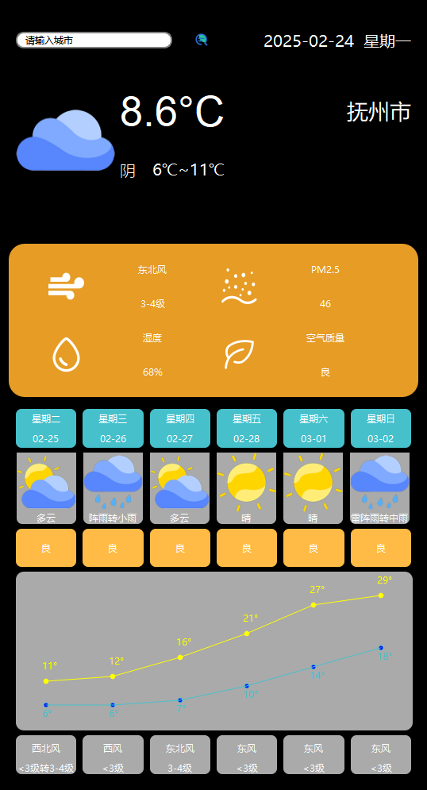

# Weather

#### 介绍
基于Qt开发的一个天气预报软件（后续还会更新）

#### 软件架构
Qt

#### 安装教程

1.  下载发行版V1.0.2d的Weather.rar。
2.  解压Weather.rar。
3.  运行a-reportWeather.exe。
#### 使用说明

1.  鼠标右键呼出菜单栏可以退出。
2.  目前暂不支持设置，只能无脑展示7天天气，上半部分展示今天天气，下半部分展示这周天气。
3.  可在顶部搜索其他城市。例如：要搜索上海市,输入“上海”,按下回车。
